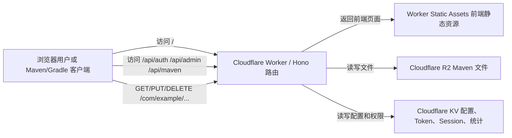

# Cloud-Maven 项目零基础导读

生成日期：2026-05-30

本文面向代码零基础读者，目标不是让你一口气看懂每一行代码，而是先建立一个清晰的地图：这个项目是什么、用了哪些技术、每个文件大概负责什么、请求从浏览器到 Cloudflare 再到 R2/KV 是怎样流动的，以及应该按什么顺序学习它。

说明：本次只做只读梳理和文档生成，没有修改业务源码，也没有执行 `npm`、`yarn`、`npx` 等命令。

## 1. 这个项目是做什么的

Cloud-Maven 是一个轻量级 Maven 仓库系统。

如果你完全没接触过 Maven，可以先把它理解成“Java 生态里用来存放依赖包的网盘”。别人写好的 `.jar` 包、`.pom` 描述文件、校验文件 `.sha1`/`.md5` 都会按照固定目录规则放进仓库。项目使用者在自己的 Java 项目里写一个依赖坐标，比如：

```xml
<dependency>
  <groupId>com.example</groupId>
  <artifactId>demo</artifactId>
  <version>1.0.0</version>
</dependency>
```

Maven/Gradle 就会根据这个坐标去仓库下载文件。

Cloud-Maven 做的事情是：

- 用 Vue 3 做一个浏览器管理界面。
- 用 Cloudflare Worker 做后端 API。
- 用 Cloudflare R2 存 Maven 文件。
- 用 Cloudflare KV 存配置、登录 Token、Session 和统计数据。
- 不强制创建 `releases`、`snapshots` 默认仓库，请求路径直接映射到 R2 key。

最核心的一句话是：

```text
浏览器界面负责操作；Worker 负责判断权限和处理请求；R2 保存文件；KV 保存小型配置数据。
```

## 2. 技术栈总览

| 分类 | 技术 | 在项目里的作用 | 零基础理解 |
|---|---|---|---|
| 语言 | TypeScript | 前端和后端都使用的主要语言 | JavaScript 的“带类型版本”，能提前发现很多低级错误 |
| 前端框架 | Vue 3 | 构建管理后台界面 | 把页面拆成组件，让数据变化时页面自动更新 |
| 前端构建 | Vite | 启动开发服务器、打包前端 | 把 `.vue`、`.ts`、CSS 打包成浏览器能运行的文件 |
| 前端样式 | UnoCSS | 提供原子化 CSS 类和快捷样式 | 像搭积木一样写样式 |
| 路由 | vue-router | 管理浏览器中的页面路径 | 让 `/com/example` 这样的路径对应到当前仓库目录 |
| HTTP 客户端 | axios | 前端调用后端 API | 用代码发起 GET/POST/PUT/DELETE 请求 |
| 弹窗 | vue-final-modal | 登录、上传、删除、Token 编辑弹窗 | 统一管理模态框 |
| Toast | mosha-vue-toastify | 操作成功/失败的小提示 | 右下角提示“上传成功”等 |
| 图标 | lucide-vue-next | 页面按钮图标 | 文件夹、上传、删除等图标 |
| 后端框架 | Hono | Worker 里的路由框架 | 根据 URL 和 HTTP 方法分发到对应函数 |
| 运行环境 | Cloudflare Workers | 无服务器后端运行环境 | 不需要自己买服务器，代码跑在 Cloudflare 边缘节点 |
| 文件存储 | Cloudflare R2 | 存 `.jar`、`.pom`、metadata、checksum | 类似对象存储网盘 |
| 键值存储 | Cloudflare KV | 存 Token、Session、设置、统计 | 类似一个超轻量数据库，按 key 找 value |
| 部署工具 | Wrangler | Cloudflare Worker 开发部署工具 | Cloudflare 官方命令行工具 |
| 测试 | Vitest | 单元测试和集成测试 | 用代码检查代码是否按预期工作 |
| Worker 测试池 | @cloudflare/vitest-pool-workers | 模拟 Worker、KV、R2 环境 | 让本地测试更接近 Cloudflare |
| 包管理 | Yarn 4 Workspaces | 管理根目录、前端、后端依赖 | 一个仓库里放多个子项目 |
| CI | GitHub Actions | 推送或 PR 时自动检查 | 云端自动跑类型检查和测试 |

## 3. 项目整体架构



项目运行后，同一个 Worker 域名同时承担三种角色：

```text
/                 前端管理界面
/api/...          登录、管理、仓库浏览 API
/com/example/...  Maven 文件真实读取、上传、删除路径
```

## 4. 核心业务原理

### 4.1 前端如何工作

前端入口是 `maven-client/src/main.ts`。它创建 Vue 应用，加载路由、弹窗插件、样式，然后挂载到 `index.html` 里的 `<div id="app"></div>`。

`App.vue` 启动时会做两件事：

- 初始化亮色/暗色主题。
- 尝试从浏览器 `localStorage` 里恢复登录 Token，并调用后端确认身份。

`router/index.ts` 使用 hash 路由，并且只有一个通配页面：`IndexPage.vue`。这意味着所有路径最终都会进入同一个主页面，再由文件浏览器根据路径加载不同 Maven 目录。

前端主要分成三个页签：

- `Overview`：仓库文件浏览、上传、删除、下载、依赖片段生成。
- `Admin`：统计信息、Token 创建、Token 编辑、Token 删除。
- `Settings`：仓库标题、base URL、匿名读取、覆盖上传、checksum 等设置。

### 4.2 后端如何工作

后端入口是 `maven-worker/src/index.ts`。它创建 Hono 应用，然后注册全局中间件和各类路由。

每个请求进来时大致会经历：

1. 生成 `requestId`，方便错误定位。
2. 设置 CORS 响应头，允许浏览器跨域请求。
3. 首次启动时尝试用 `ADMIN_BOOTSTRAP_TOKEN` 创建默认管理员 Token。
4. 分发到 `/api/auth`、`/api/admin`、`/api/maven` 或直接 Maven 文件路径。
5. 请求结束后异步写入当天请求统计。
6. 如果出错，统一返回 JSON 错误，并写入错误统计。

后端的关键设计是“路径即对象 key”：

```text
HTTP 路径: /com/example/demo/1.0.0/demo-1.0.0.jar
R2 key:   com/example/demo/1.0.0/demo-1.0.0.jar
```

它没有把文件放到传统数据库，而是直接放到 R2 对象存储中。

### 4.3 登录与权限如何工作

项目使用 Token 认证。Token 不是明文保存的，而是用 PBKDF2 + salt 做哈希后存到 KV。

支持的认证方式：

- `Authorization: xBasic base64(name:secret)`：类似 Reposilite 风格，适合 API 和 Maven 场景。
- `Authorization: Bearer sessionId`：使用登录后创建的 Session。
- `cloud_maven_session` Cookie：浏览器登录后可携带的 HttpOnly Cookie。

权限模型是按路径和动作判断：

```text
path: /
actions: read, write, delete, manage
```

普通 `read/write/delete` 会匹配路径前缀；`manage` 是全局管理能力。后端会优先匹配最长路径前缀，避免短路径权限误覆盖更具体的路径。

### 4.4 Maven 文件读写如何工作

文件读取：

1. 浏览器或 Maven 客户端请求某个路径。
2. Worker 校验路径是否安全，禁止空路径、反斜杠、`..`、HTML 特殊字符、保留的 `/api` 路径等。
3. 如果仓库是公开读取，匿名用户可以读；否则必须带 Token。
4. Worker 从 R2 读取对象。
5. 根据扩展名设置 `Content-Type`，根据是否 snapshot/metadata 设置缓存策略。

文件上传：

1. 必须有 `write` 权限。
2. Worker 检查 release/snapshot 是否允许重复上传。
3. 把请求体写入 R2。
4. 如果请求头 `X-Generate-Checksums: true`，还会生成 `.sha1` 和 `.md5`。

文件删除：

1. 必须有 `delete` 权限。
2. 如果是单个文件，就删除该文件和常见 checksum 文件。
3. 如果是目录，就按前缀批量删除 R2 对象。

### 4.5 配置如何工作

配置主要存在 KV：

- `config:repository`：仓库可见性、release 是否可覆盖、snapshot 是否可覆盖。
- `config:settings`：前端 Settings 页面配置。
- `token:{id}`：Token 主数据。
- `token-name:{name}`：Token 名称到 id 的索引。
- `session:{id}`：登录 Session。
- `stats:daily:{yyyyMMdd}:requests`：每日请求数。
- `stats:daily:{yyyyMMdd}:errors`：每日错误数。

如果某些配置还不存在，后端会写入默认值。

## 5. 文件作用总表

### 5.1 根目录

| 文件 | 作用 | 给小白的解释 |
|---|---|---|
| `.gitignore` | 声明哪些本地文件不提交到 Git | 忽略依赖、构建产物、环境变量、Wrangler 临时文件 |
| `AGENTS.md` | Agent 工作规则 | 规定不同角色能改哪些文件、不能执行哪些命令 |
| `USAGE.md` | Cloudflare 部署教程 | 教用户如何创建 R2/KV、配置 Worker、设置管理员 Token |
| `package.json` | 根工作区脚本和包管理配置 | 把前端和后端作为 Yarn workspace 管起来 |
| `workspace.config.json` | 机器可读的项目清单和任务编排 | 告诉脚本有哪些子项目、哪些任务要串行或并行执行 |
| `yarn.lock` | 依赖锁定文件 | 确保不同机器安装到一致的依赖版本 |
| `PROJECT_GUIDE.md` | 本文件 | 项目总览、文件说明、零基础学习路线 |

### 5.2 辅助目录

| 文件 | 作用 | 给小白的解释 |
|---|---|---|
| `.github/workflows/ci.yml` | GitHub Actions 自动检查配置 | 代码推送或 PR 时分别检查前端和后端 |
| `.claude/settings.local.json` | 本地 Claude/Codex 相关权限配置 | 只影响本地辅助工具，不是项目运行核心 |
| `scripts/workspace.mjs` | 工作区任务执行器 | 读取 `workspace.config.json`，然后到对应子项目执行脚本 |
| `agents/Client.md` | 前端 Agent 手册 | 前端角色的任务说明和交接记录 |
| `agents/Worker.md` | 后端 Agent 手册 | 后端角色的任务说明和交接记录 |
| `agents/Test.md` | 测试 Agent 手册 | 测试角色的任务说明 |
| `agents/Secur.md` | 安全审计 Agent 手册 | 安全角色记录审计建议 |

### 5.3 前端配置文件

| 文件 | 作用 | 给小白的解释 |
|---|---|---|
| `maven-client/package.json` | 前端依赖和脚本 | 声明 Vue、Vite、axios、UnoCSS 等前端依赖 |
| `maven-client/index.html` | 前端 HTML 入口 | 浏览器最先加载的 HTML，Vue 会挂载到 `#app` |
| `maven-client/vite.config.ts` | Vite 配置 | 配置 Vue 插件、UnoCSS、`@` 路径别名、构建拆包 |
| `maven-client/uno.config.ts` | UnoCSS 配置 | 定义主题色、字体、常用样式快捷类 |
| `maven-client/tsconfig.json` | TypeScript 配置 | 告诉 TS 如何检查前端代码 |
| `maven-client/vitest.config.ts` | 前端测试配置 | 配置 Vitest 和 `@` 路径别名 |

### 5.4 前端入口与基础类型

| 文件 | 作用 | 给小白的解释 |
|---|---|---|
| `maven-client/src/main.ts` | Vue 应用入口 | 导入样式、创建应用、挂载路由和弹窗插件 |
| `maven-client/src/App.vue` | 根组件 | 初始化主题和登录状态，显示当前路由页面 |
| `maven-client/src/router/index.ts` | 前端路由 | 所有路径都交给 `IndexPage.vue` 处理 |
| `maven-client/src/types.ts` | 共享类型定义 | 定义文件条目、仓库详情、Token、设置等数据形状 |
| `maven-client/src/env.d.ts` | 前端类型声明 | 让 TS 认识 `.vue` 文件和第三方 toast 包 |

### 5.5 前端 API 封装

| 文件 | 作用 | 给小白的解释 |
|---|---|---|
| `maven-client/src/api/client.ts` | axios 实例和通用工具 | 统一 API base URL、超时、认证头、文件 URL 生成 |
| `maven-client/src/api/auth.ts` | 登录 API | 封装 `/api/auth/me`、`/login`、`/logout` |
| `maven-client/src/api/admin.ts` | 管理 API | 封装统计、Token 增删改查接口 |
| `maven-client/src/api/maven.ts` | Maven 文件 API | 封装目录详情、读取、下载、上传、删除 |
| `maven-client/src/api/settings.ts` | 设置 API | 封装 `/api/admin/settings` 读取和保存 |
| `maven-client/src/api/client.test.ts` | API 通用工具测试 | 检查文件 URL 生成和 xBasic 认证头生成 |
| `maven-client/src/api/auth.test.ts` | 登录 API 测试 | 检查登录、退出、当前用户接口路径是否正确 |
| `maven-client/src/api/admin.test.ts` | 管理 API 测试 | 检查统计、Token 增删改查接口路径和参数 |
| `maven-client/src/api/maven.test.ts` | Maven API 测试 | 检查目录详情、下载、上传、删除、目录删除接口 |
| `maven-client/src/api/settings.test.ts` | 设置 API 测试 | 检查设置读取和保存接口 |

### 5.6 前端状态与工具

| 文件 | 作用 | 给小白的解释 |
|---|---|---|
| `maven-client/src/composables/useSession.ts` | 登录状态管理 | 保存 Token 到 localStorage，提供登录、退出、权限判断 |
| `maven-client/src/composables/useRepository.ts` | 仓库目录状态 | 加载目录、缓存结果、处理加载中和错误状态 |
| `maven-client/src/composables/useMavenMetadata.ts` | Maven metadata 解析 | 从路径或 `maven-metadata.xml` 推断 groupId、artifactId、version |
| `maven-client/src/composables/useTheme.ts` | 主题状态 | 在亮色/暗色模式间切换，并保存用户选择 |
| `maven-client/src/composables/useClipboardToast.ts` | 复制工具 | 复制文本到剪贴板并弹出提示 |
| `maven-client/src/composables/useSession.test.ts` | 登录状态测试 | 检查登录状态、权限判断、manager 权限 |
| `maven-client/src/composables/useRepository.test.ts` | 仓库状态测试 | 检查目录加载、缓存、强制刷新、错误状态 |
| `maven-client/src/composables/useMavenMetadata.test.ts` | metadata 工具测试 | 检查坐标推断、metadata 候选路径、XML 解析和合并 |

### 5.7 前端页面

| 文件 | 作用 | 给小白的解释 |
|---|---|---|
| `maven-client/src/pages/IndexPage.vue` | 主页面和页签容器 | 控制 Overview/Admin/Settings 三个区域的显示 |
| `maven-client/src/pages/AdminPage.vue` | 管理页 | 显示统计，创建、编辑、启用/禁用、删除 Token |
| `maven-client/src/pages/SettingsPage.vue` | 设置页 | 读取和保存仓库行为配置 |

### 5.8 前端组件

| 文件 | 作用 | 给小白的解释 |
|---|---|---|
| `maven-client/src/components/header/DefaultHeader.vue` | 顶部栏 | 显示项目名、主题切换、登录/退出、移动端菜单 |
| `maven-client/src/components/header/LoginModal.vue` | 登录弹窗 | 输入 Token 名称和 secret，调用登录逻辑 |
| `maven-client/src/components/browser/FileBrowserView.vue` | 文件浏览器主视图 | 根据当前路径加载目录，并组合面包屑、列表、上传、依赖片段 |
| `maven-client/src/components/browser/BreadcrumbNavigation.vue` | 面包屑导航 | 把路径拆成可点击的层级链接 |
| `maven-client/src/components/browser/FileList.vue` | 文件列表 | 展示目录和文件，提供下载和删除入口 |
| `maven-client/src/components/browser/UploadArtifactModal.vue` | 上传弹窗 | 选择文件、目标文件名、是否生成 checksum，然后上传 |
| `maven-client/src/components/browser/DeleteEntryModal.vue` | 旧版删除弹窗 | 按当前目录和文件名计算路径后删除，当前列表主要使用新版删除组件 |
| `maven-client/src/components/browser/DeleteArtifactModal.vue` | 删除文件/目录弹窗 | 文件走直接删除，目录走 artifacts API 前缀删除 |
| `maven-client/src/components/browser/DeleteArtifactModal.test.ts` | 删除弹窗测试 | 检查目录和文件会调用不同删除接口 |
| `maven-client/src/components/card/SnippetsCard.vue` | 依赖片段卡片 | 生成 Maven、Gradle Kotlin、Gradle Groovy 依赖代码 |
| `maven-client/src/components/admin/TokenEditorModal.vue` | Token 编辑弹窗 | 创建或编辑 Token 的名称、描述、路径和权限 |
| `maven-client/src/components/admin/TokenEditorModal.test.ts` | Token 弹窗测试 | 检查路径会标准化成 `/xxx`，新建/编辑状态会正确重置 |
| `maven-client/src/components/common/LoadingState.vue` | 加载状态 | 显示加载动画和文案 |
| `maven-client/src/components/common/ErrorState.vue` | 错误状态 | 显示错误提示和重试按钮 |
| `maven-client/src/components/common/EmptyState.vue` | 空状态 | 目录为空时显示提示 |

### 5.9 前端样式

| 文件 | 作用 | 给小白的解释 |
|---|---|---|
| `maven-client/src/styles/base.css` | 全局基础样式 | 字体、滚动条、焦点、按钮输入框默认过渡等 |
| `maven-client/src/styles/transitions.css` | 动画样式 | 页面切换、卡片悬浮等过渡动画 |

### 5.10 Worker 配置文件

| 文件 | 作用 | 给小白的解释 |
|---|---|---|
| `maven-worker/.gitignore` | Worker 子目录忽略规则 | 避免把 Worker 依赖、构建产物、本地环境变量提交到 Git |
| `maven-worker/package.json` | Worker 依赖和脚本 | 声明 Hono、Wrangler、Worker 测试工具等 |
| `maven-worker/README.md` | Worker 部署说明 | 单 Worker 部署、绑定、环境变量、KV key 说明 |
| `maven-worker/wrangler.toml` | Cloudflare Worker 配置 | 定义 Worker 名称、入口、静态资源、R2/KV 绑定、环境变量 |
| `maven-worker/tsconfig.json` | Worker TypeScript 配置 | 让 TS 按 Cloudflare Worker 环境检查后端代码 |
| `maven-worker/vitest.config.ts` | Worker 测试配置 | 配置 Miniflare、KV、R2 模拟环境 |

### 5.11 Worker 源码

| 文件 | 作用 | 给小白的解释 |
|---|---|---|
| `maven-worker/src/index.ts` | Worker 总入口 | 创建 Hono 应用，注册中间件、API 路由、静态资源、Maven 文件路由 |
| `maven-worker/src/env.ts` | 后端类型定义 | 定义 KV/R2/Assets 绑定、Token、Session、配置等类型 |
| `maven-worker/src/auth/index.ts` | 认证模块 | 解析 xBasic、Bearer、Cookie，登录、登出、权限中间件 |
| `maven-worker/src/admin/index.ts` | 管理 API | 统计、Token 管理、Settings 读取和保存 |
| `maven-worker/src/maven/index.ts` | Maven 核心 API | 文件读写删、目录浏览、metadata 读取、POM 生成 |
| `maven-worker/src/tokens/index.ts` | Token 和 Session 模块 | 创建 Token、哈希 secret、校验权限、创建 Session |
| `maven-worker/src/config/index.ts` | 配置模块 | 从 KV 读取/写入仓库策略和前端设置 |
| `maven-worker/src/storage/index.ts` | R2 封装 | 对 R2 的 get/head/put/delete/list 做薄封装 |
| `maven-worker/src/shared/index.ts` | shared 出口 | 统一导出错误、路径、响应、MIME、checksum 工具 |
| `maven-worker/src/shared/errors.ts` | 错误类型 | 定义 `BAD_REQUEST`、`UNAUTHORIZED`、`FORBIDDEN` 等统一错误 |
| `maven-worker/src/shared/responses.ts` | 响应工具 | 统一返回 JSON 数据、JSON 错误、204 空响应 |
| `maven-worker/src/shared/path.ts` | 路径安全工具 | 清理并校验 Maven 路径，阻止危险路径进入 R2 |
| `maven-worker/src/shared/mime.ts` | 文件类型和缓存工具 | 根据扩展名设置 Content-Type，根据 snapshot/metadata 设置缓存 |
| `maven-worker/src/shared/checksum.ts` | checksum 工具 | 生成 SHA-1 和 MD5 十六进制摘要 |

### 5.12 Worker 测试文件

| 文件 | 作用 | 给小白的解释 |
|---|---|---|
| `maven-worker/test/env.d.ts` | 测试环境类型 | 让测试代码识别 Worker 测试池提供的类型 |
| `maven-worker/test/auth/auth.test.ts` | 认证解析测试 | 检查 xBasic 是否能正确解析或拒绝 |
| `maven-worker/test/config/config.test.ts` | 配置测试 | 检查默认配置、持久化、配置合并 |
| `maven-worker/test/tokens/permissions.test.ts` | 权限测试 | 检查最长路径匹配、路径段匹配、manage 权限 |
| `maven-worker/test/shared/path.test.ts` | 路径测试 | 检查路径标准化和危险路径拒绝 |
| `maven-worker/test/shared/mime.test.ts` | MIME 和缓存测试 | 检查 Maven 文件类型、snapshot/metadata 缓存策略 |
| `maven-worker/test/shared/checksum.test.ts` | checksum 测试 | 检查 SHA-1、MD5 生成结果 |
| `maven-worker/test/maven/metadata.test.ts` | metadata 测试 | 检查 latest/release 版本推断 |
| `maven-worker/test/integration/auth-admin-routes.test.ts` | 管理集成测试 | 检查登录、Session、Token 管理、设置、统计接口 |
| `maven-worker/test/integration/maven-routes.test.ts` | Maven 路由集成测试 | 检查健康检查、读写删文件、checksum、POM 生成、metadata、私有仓库访问控制 |

## 6. 关键请求流程

### 6.1 打开首页

```text
浏览器访问 /
  -> Worker 收到请求
  -> 判断是静态资源路径
  -> 从 ASSETS 返回前端 HTML/CSS/JS
  -> Vue 应用启动
```

### 6.2 浏览 Maven 目录

```text
前端当前路径 /com/example
  -> FileBrowserView 监听路由变化
  -> useRepository.load("com/example")
  -> mavenApi.details("com/example")
  -> GET /api/maven/details/com/example
  -> Worker 校验权限
  -> R2 list prefix "com/example/"
  -> 返回目录和文件列表
```

### 6.3 下载文件

```text
用户点击文件
  -> 前端请求 /com/example/demo/1.0.0/demo-1.0.0.jar
  -> Worker 校验路径和 read 权限
  -> R2 get 对象
  -> 返回文件流
```

### 6.4 上传文件

```text
用户选择文件并点击 Upload
  -> 前端 PUT /目标路径
  -> 请求头带 X-Generate-Checksums
  -> Worker 校验 write 权限
  -> Worker 检查是否允许重复上传
  -> 写入 R2
  -> 可选生成 .sha1 和 .md5
```

### 6.5 管理 Token

```text
管理员打开 Admin
  -> 前端 GET /api/admin/stats 和 /api/admin/tokens
  -> Worker 的 auth({ permission: "manage" }) 中间件校验 manage 权限
  -> KV 读取 Token 列表
  -> 返回给前端展示
```

## 7. 当前测试覆盖在保护什么

前端测试主要保护：

- API 封装是否调用正确路径。
- 登录状态和权限判断是否正确。
- 仓库目录缓存和错误状态是否正确。
- Maven metadata 推断和解析是否正确。
- Token 编辑弹窗和删除弹窗行为是否正确。

后端测试主要保护：

- 路径安全。
- MIME 类型和缓存策略。
- checksum 生成。
- Token 权限匹配。
- 配置读写。
- 登录、Session、管理 API。
- Maven 文件读写删、metadata、POM 生成、匿名/私有访问控制。

也就是说，这个项目的测试重点偏“接口行为”和“核心规则”，不是单纯测试 UI 长什么样。

## 8. 零基础学习路线

### 第 0 阶段：先不要急着改代码

先记住四个词：

- 前端：你在浏览器里看到的页面。
- 后端：接收请求、处理权限、读写数据的代码。
- R2：存文件的地方。
- KV：存小数据的地方。

理解下面这句话就够了：

```text
前端问 Worker 要数据，Worker 按权限去 R2/KV 拿数据，再把结果还给前端。
```

### 第 1 阶段：补最小基础

建议按顺序学习：

1. HTML：知道 `<div>`、`<button>`、`<input>` 是什么。
2. CSS：知道颜色、间距、布局、hover、dark mode 是什么。
3. JavaScript：知道变量、函数、对象、数组、Promise。
4. TypeScript：知道 interface/type 是在描述数据形状。
5. HTTP：知道 GET 读取、POST 创建、PUT 上传/更新、DELETE 删除。
6. JSON：知道前后端常用 JSON 交换数据。

### 第 2 阶段：读前端入口

按这个顺序打开文件：

1. `maven-client/index.html`
2. `maven-client/src/main.ts`
3. `maven-client/src/App.vue`
4. `maven-client/src/router/index.ts`
5. `maven-client/src/pages/IndexPage.vue`

你要回答的问题是：

- Vue 应用挂载到了哪里？
- 为什么所有路径都进 `IndexPage.vue`？
- 三个页签是在哪里决定显示的？

### 第 3 阶段：读文件浏览功能

按这个顺序打开文件：

1. `maven-client/src/components/browser/FileBrowserView.vue`
2. `maven-client/src/composables/useRepository.ts`
3. `maven-client/src/api/maven.ts`
4. `maven-worker/src/maven/index.ts`
5. `maven-worker/src/storage/index.ts`

你要把这条链路连起来：

```text
页面路径变化 -> 前端请求 details API -> Worker list R2 -> 前端显示文件列表
```

### 第 4 阶段：读登录和权限

按这个顺序打开文件：

1. `maven-client/src/components/header/LoginModal.vue`
2. `maven-client/src/composables/useSession.ts`
3. `maven-client/src/api/auth.ts`
4. `maven-worker/src/auth/index.ts`
5. `maven-worker/src/tokens/index.ts`

重点理解：

- 前端把 Token 名称和 secret 存在哪里。
- 后端为什么不保存 secret 明文。
- `read/write/delete/manage` 分别控制什么。
- 为什么路径权限要做前缀匹配。

### 第 5 阶段：读管理后台

按这个顺序打开文件：

1. `maven-client/src/pages/AdminPage.vue`
2. `maven-client/src/components/admin/TokenEditorModal.vue`
3. `maven-client/src/api/admin.ts`
4. `maven-worker/src/admin/index.ts`

重点理解：

- 管理页为什么要求 manager 权限。
- 创建 Token 时 secret 为什么只返回一次。
- 删除最后一个 manager Token 为什么会被禁止。

### 第 6 阶段：读设置功能

按这个顺序打开文件：

1. `maven-client/src/pages/SettingsPage.vue`
2. `maven-client/src/api/settings.ts`
3. `maven-worker/src/config/index.ts`
4. `maven-worker/src/admin/index.ts` 里的 `/settings` 路由

重点理解：

- `anonymousRead` 如何映射到仓库的 `PUBLIC`/`PRIVATE`。
- `allowOverwrite` 如何映射到 release 是否可重复上传。
- 为什么配置存在 KV 里。

### 第 7 阶段：读 Maven 规则

按这个顺序打开文件：

1. `maven-worker/src/shared/path.ts`
2. `maven-worker/src/shared/mime.ts`
3. `maven-worker/src/shared/checksum.ts`
4. `maven-worker/src/maven/index.ts`
5. `maven-client/src/components/card/SnippetsCard.vue`
6. `maven-client/src/composables/useMavenMetadata.ts`

重点理解：

- Maven 坐标如何变成路径。
- `maven-metadata.xml` 如何帮助推断版本。
- snapshot 和 release 的缓存策略为什么不同。
- checksum 文件为什么常见于 Maven 仓库。

### 第 8 阶段：读测试

先不要一口气看所有测试。按“最接近业务”的顺序：

1. `maven-worker/test/integration/maven-routes.test.ts`
2. `maven-worker/test/integration/auth-admin-routes.test.ts`
3. `maven-client/src/api/maven.test.ts`
4. `maven-client/src/composables/useRepository.test.ts`
5. `maven-client/src/composables/useMavenMetadata.test.ts`

读测试时不要怕代码长。测试通常像小故事：

```text
先准备数据 -> 调用某个功能 -> 断言结果是否符合预期
```

## 9. 建议的练习任务

以下练习适合从易到难推进。做练习时要遵守 `AGENTS.md` 的角色边界。

### 练习 1：只读理解

目标：在纸上画出“浏览目录”的流程。

参考文件：

- `FileBrowserView.vue`
- `useRepository.ts`
- `maven.ts`
- `maven-worker/src/maven/index.ts`

完成标准：你能说清楚 `/api/maven/details/foo/bar` 最终为什么会去 R2 list `foo/bar/`。

### 练习 2：认识类型

目标：看懂 `RepositoryEntry`。

参考文件：

- `maven-client/src/types.ts`
- `maven-worker/src/maven/index.ts`

完成标准：你能解释 `name`、`path`、`type`、`size`、`updatedAt`、`permissions` 分别来自哪里、用在哪里。

### 练习 3：理解权限

目标：解释一个 Token 为什么能或不能删除某个文件。

参考文件：

- `maven-worker/src/tokens/index.ts`
- `maven-worker/src/maven/index.ts`
- `maven-worker/test/tokens/permissions.test.ts`

完成标准：你能解释“路径前缀匹配”和“最长路径优先”。

### 练习 4：理解上传

目标：说明上传一个 `.jar` 文件发生了什么。

参考文件：

- `UploadArtifactModal.vue`
- `maven-client/src/api/maven.ts`
- `maven-worker/src/maven/index.ts`
- `maven-worker/src/shared/checksum.ts`

完成标准：你能解释普通上传和带 checksum 上传的区别。

### 练习 5：理解部署

目标：读懂 `USAGE.md` 和 `wrangler.toml`。

参考文件：

- `USAGE.md`
- `maven-worker/README.md`
- `maven-worker/wrangler.toml`

完成标准：你能说清楚为什么部署 `maven-worker` 时也会构建 `maven-client`。

## 10. 初学者常见误区

| 误区 | 正确理解 |
|---|---|
| “前端保存了文件” | 前端只是选择文件和发请求，真正保存文件的是 Worker 写入 R2 |
| “路径只是页面地址” | 在这个项目里，Maven 路径同时也是 R2 对象 key |
| “Token secret 可以再查出来” | 后端只保存哈希，创建后 secret 只返回一次 |
| “KV 是数据库，可以放大文件” | KV 适合小配置和索引，大文件应该放 R2 |
| “所有用户都能管理后台” | 只有带 `manage` 权限的 Token 才能访问管理接口 |
| “release 和 snapshot 一样缓存” | release 默认长期缓存，snapshot 和 metadata 通常不缓存 |

## 11. 如果要继续完善项目，可以关注什么

这些不是本次修改内容，只是阅读后的学习方向：

- 前端 UI 可以继续减少重复的 modal 样式。
- `DeleteEntryModal.vue` 看起来像旧版删除弹窗，当前主列表使用 `DeleteArtifactModal.vue`，后续可确认是否仍需要保留。
- `maintainMetadata` 已有设置项，但 Worker 默认不主动重写 `maven-metadata.xml`，后续若要自动维护 metadata，需要专门设计。
- `wrangler.toml` 的 production R2/KV 绑定仍是空值，部署前必须填写。
- `USAGE.md` 里提到普通 HTTP Basic Auth 需要确认兼容；当前源码主要实现的是 `xBasic`、Bearer 和 Cookie Session。

## 12. 一句话总结

Cloud-Maven 的代码可以按这条主线理解：

```text
Vue 页面负责让人操作 Maven 仓库；
axios 把操作变成 HTTP 请求；
Hono Worker 接收请求并校验权限；
R2 保存 Maven 文件；
KV 保存配置、Token、Session 和统计；
测试文件保护这些规则不被改坏。
```

先把这条线读顺，再去看单个组件和函数，整个项目就会从“一堆陌生文件”变成一张能导航的地图。
