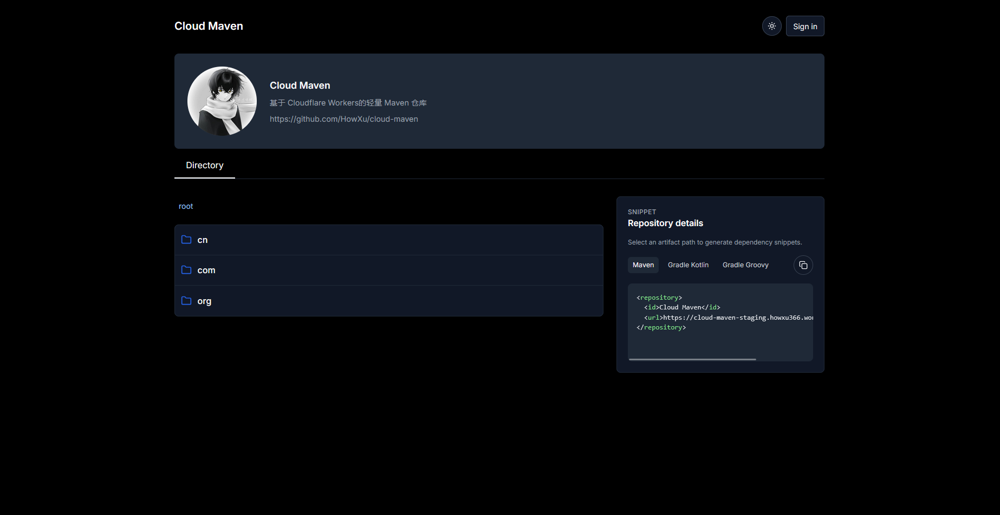
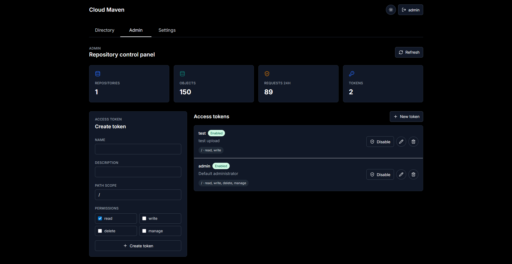
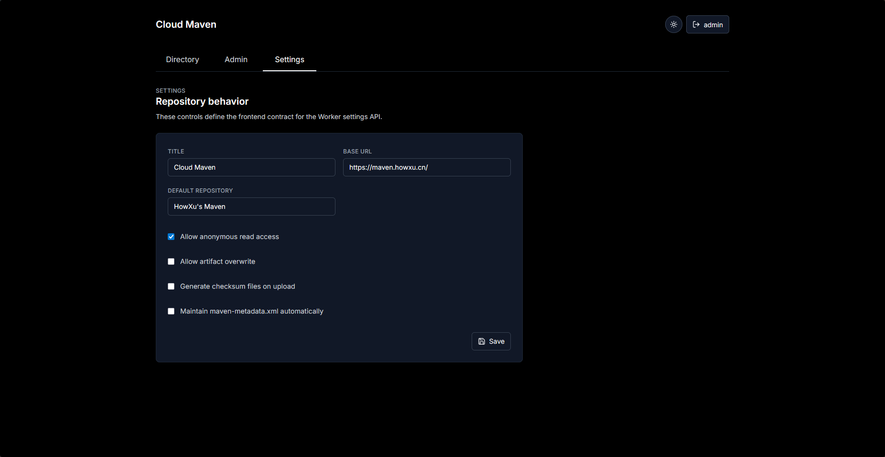
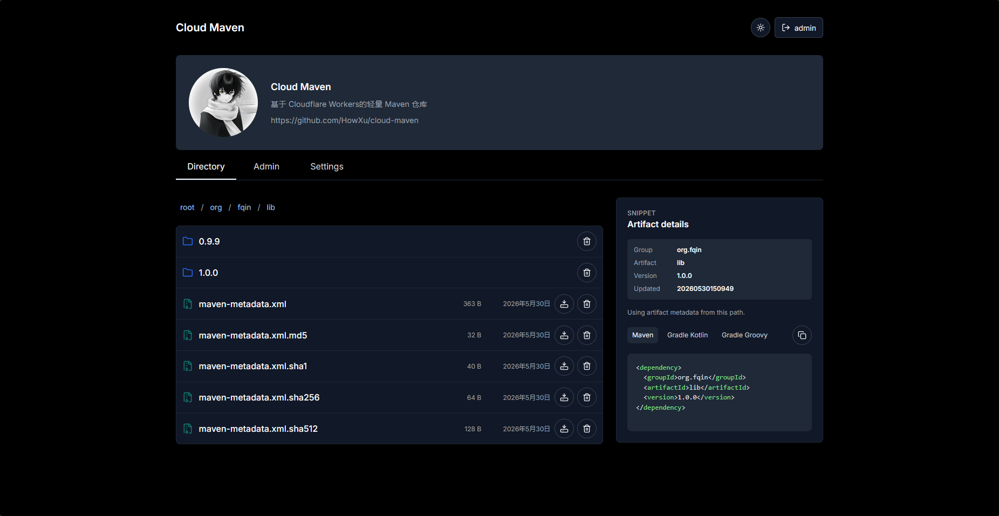
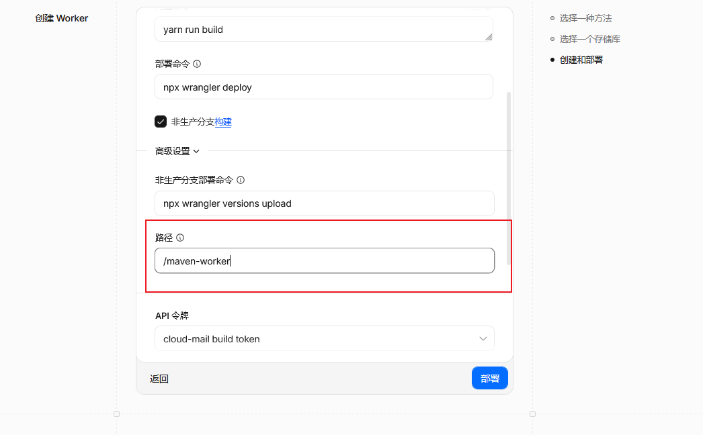

<p align="center">
    <h1 align="center">Cloud-Maven</h1>
    <p align="center">基于 Cloudflare Workers 的轻量 Maven 私有仓库，一键部署 🎉</p>
    <p align="center">
        <a href="./README-en.md">English</a>
    </p>
</p>

## 项目简介

只需一个 Cloudflare Worker，即可部署带管理界面的 Maven 私有仓库。支持 Maven/Gradle 客户端直连推送和拉取，参考 Reposilite 前端体验。

## 项目展示

|  |  |
|-------------------------|-------------------------|
|  |  |

## 功能特性

- **一键部署** — Fork 仓库后通过 Cloudflare Dashboard 导入，无需管理服务器
- **前端管理界面** — 目录浏览、Token 管理、系统设置，开箱即用
- **Maven 协议兼容** — `mvn deploy`、`mvn release` 直接可用，支持 `settings.xml` 鉴权
- **R2 对象存储** — 制品直接映射到 R2 Key，无容量限制
- **按需生成 Checksum** — 小文件自动生成 SHA1/MD5，大文件推荐客户端自行上传
- **细粒度权限** — Token 级别路径权限控制，支持匿名读取

## 技术栈

- **Runtime**: [Cloudflare Workers](https://developers.cloudflare.com/workers/)
- **Web 框架**: [Hono](https://hono.dev/)
- **前端**: Vue 3 + TypeScript + Vite + UnoCSS
- **存储**: Cloudflare R2 + Workers KV
- **安全**: PBKDF2-SHA256 Token 哈希、HttpOnly Cookie Session、CORS 可配置

## 目录结构

```
cloud-maven
├── maven-worker/          # Cloudflare Worker 后端
│   ├── src/
│   │   ├── auth/          # 鉴权：xBasic / Bearer / Cookie Session
│   │   ├── tokens/        # Token CRUD、权限匹配、bootstrap
│   │   ├── admin/         # Admin API：统计、Token 管理、Settings
│   │   ├── maven/         # Maven 文件路由：GET/HEAD/PUT/DELETE
│   │   ├── config/        # KV 仓库策略与 Settings 读写
│   │   ├── storage/       # R2 适配层
│   │   └── shared/        # 路径校验、MIME、checksum、错误响应
│   ├── test/              # Vitest 单元测试 + 集成测试
│   ├── wrangler.toml      # 生产部署配置
│   └── wrangler-dev.toml  # 本地开发配置
│
└── maven-client/          # Vue 3 前端管理界面
    ├── src/
    │   ├── api/           # axios 请求封装
    │   ├── composables/   # useSession、useRepository、useMavenMetadata
    │   ├── pages/         # IndexPage、AdminPage、SettingsPage
    │   └── components/    # Header、FileBrowser、TokenEditor、DeleteModal
    └── dist/              # 前端构建产物（部署到 Worker）
```

## 部署指南

### 1. 准备 Cloudflare 资源

进入 [Cloudflare Dashboard](https://dash.cloudflare.com/)，创建以下资源：

- **R2 bucket**：命名为 `cloud-maven`
- **Workers KV namespace**：命名为 `cloud-maven-kv`，复制其 `id`

### 2. Fork 并导入仓库

1. Fork 本仓库到你的 GitHub 账号
2. 进入 Cloudflare Dashboard → **Workers & Pages** → **创建 Worker** → **从 Git 导入**
3. 连接你的 fork 仓库，调整 Cloudflare 部署设置中的高级设置，将目录设置为`maven-worker`:



### 3. 配置绑定

在 `wrangler.toml`（或通过 Dashboard）中填入 KV namespace id。**不要将 `ADMIN_BOOTSTRAP_TOKEN` 写入配置文件**，它将通过 Secret 设置。

```toml
[[kv_namespaces]]
binding = "MAVEN_KV"
#id = "输入后删除#或者直接使用Cloudflare控制台绑定"

[[r2_buckets]]
binding = "MAVEN_BUCKET"
#bucket_name = "输入后删除#或者直接使用Cloudflare控制台绑定"
```

### 4. 设置管理员 Secret

导入后，进入 Worker → **Settings** → **Variables and Secrets**：

```
Name: ADMIN_BOOTSTRAP_TOKEN
Value: 你生成的强密码
```

保存后重新部署 Worker，访问 `/api/status/health` 触发初始化。

### 5. 登录后台

访问 Worker 根地址，使用以下凭据登录：

```
用户名: admin
密码: ADMIN_BOOTSTRAP_TOKEN 的值
```

### 6. 个性化设置

前端界面部分配置在`maven-client/src/site.config.ts`文件中直接静态编译

```ts
export const siteConfig: SiteConfig = {
  title: "网站标题",
  faviconUrl: "网站图标URL",
  introImageUrl: "卡片图标URL",
  introTitle: "介绍页标题",
  introLines: [
    "String数组，多行可写"
  ],
  showGithubButton: false, // 是否展示本仓库
};
```

涉及某些计算步骤的配置则可在登录管理员账号后在Settings卡片中设置


> 首次登录后建议在 Admin 页面创建新的管理员 Token，再禁用或轮换 bootstrap 管理员。

## Maven 仓库地址

```xml
<repositories>
  <repository>
    <id>cloud-maven</id>
    <url>https://你的-worker域名/</url>
  </repository>
</repositories>
```

推荐绑定自定义域名后使用：

```xml
<repositories>
  <repository>
    <id>cloud-maven</id>
    <url>https://repo.example.com/</url>
  </repository>
</repositories>
```

## 本地开发

```bash
cd maven-worker
wrangler dev --config wrangler-dev.toml
```

## 健康检查

```
GET /api/status/health
```

响应：`{"status":"ok"}`

## 关键 KV Keys

| Key | 说明 |
|-----|------|
| `config:repository` | 仓库可见性与重复上传策略 |
| `config:settings` | 前端 Settings 页面配置 |
| `token:{id}` | Token 主记录 |
| `token-name:{name}` | Token name → id 索引 |
| `session:{id}` | 登录 Session（TTL 24h） |
| `stats:daily:{yyyyMMdd}:*` | 当天请求/错误计数 |

## 实现边界

- Maven 路径直接映射到 R2 Key，不创建默认 `releases`/`snapshots` 子仓库
- PUBLIC 仓库允许匿名读取，写入和删除需要 Token
- 默认禁止重复上传（`allowOverwrite: false`），管理员可按需开启
- `X-Generate-Checksums: true` 会读取完整请求体，小文件适用；大文件推荐客户端自行上传 checksum
- `maintainMetadata` 已持久化，服务端默认不主动重写 `maven-metadata.xml`

## 常见问题

**导入后只看到 Worker，没有前端**

确认 Cloudflare 导入时目录选择的是 `maven-worker`，且 `wrangler.toml` 中有 `[assets]` 配置段。

**KV id 无效**

确认 `wrangler.toml` 中 `[env.production.kv_namespaces]` 的 `id` 已填入真实值。

**登录 admin 失败**

确认已设置 `ADMIN_BOOTSTRAP_TOKEN` Secret 并重新部署 Worker。

**R2 里没有文件**

确认上传请求打到的是 Worker 域名，制品由 Worker 写入 R2，而非直接写入 R2。

## 官方参考

- [Cloudflare Workers Static Assets](https://developers.cloudflare.com/workers/static-assets/)
- [Cloudflare Workers Builds 配置](https://developers.cloudflare.com/workers/ci-cd/builds/configuration/)
- [Cloudflare R2](https://developers.cloudflare.com/r2/)
- [Cloudflare Workers KV](https://developers.cloudflare.com/workers/wrangler/commands/kv/)
- [Cloudflare Workers Secrets](https://developers.cloudflare.com/workers/configuration/secrets/)
- 参考项目 [maillab/cloud-mail](https://github.com/maillab/cloud-mail)

## 欢迎参与

我们欢迎任何形式的贡献！

- **Issue**：Bug 报告、功能建议、问题讨论
- **Pull Request**：修复 Bug、实现新功能、改进文档
- **Star**：是对项目最好的支持

### PR 要求

- 提交信息请使用中文或英文，描述清晰
- 新功能请附带测试用例
- 代码风格保持一致（已使用 ESLint + Prettier）
- 如果不确定是否适合作为 PR，欢迎先开 Issue 讨论

## 许可证

[MIT](LICENSE)
